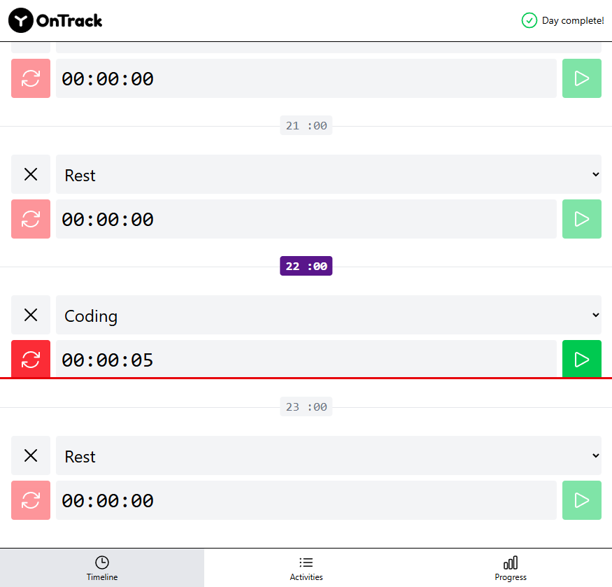

# 🎯 Activity tracker

Приложение для трекинга времени и управления активностями с визуализацией прогресса и временной шкалой.
✅ Адаптивный дизайн для всех устройств
📱 Мобильная навигация через нижнее меню
⏱️ Точный трекинг времени с секундомером
📊 Визуализация прогресса по активностям

## 🚀 Демо


Откройте приложение в браузере: [Activity Tracker Demo](https://activity-tracker-indol.vercel.app/).

## ⚡ Быстрый старт

```bash
git clone https://github.com/matveygladkikh/Activity-tracker.git
cd Activity-tracker
npm install
npm run dev
```

## 🛠 Стек

- **Vue 3** - реактивный фреймворк
- **Tailwind CSS** - утилитарный CSS фреймворк
- **Vite** - быстрый сборщик
- **JavaScript ES6+** - современный JS
- **LocalStorage** - локальное хранение данных
- **Heroicons** - иконки

## 📂 Структура проекта

```
src/
├── components/          # Переиспользуемые компоненты
│   ├── ActivityItem.vue
│   ├── TimelineItem.vue
│   ├── ProgressItem.vue
│   └── ...
├── pages/              # Страницы приложения
│   ├── TheActivities.vue
│   ├── TheTimeline.vue
│   └── TheProgress.vue
├── activities.js       # Управление активностями
├── timeline-items.js   # Логика временной шкалы
├── storage.js          # Работа с LocalStorage
├── time.js            # Утилиты для работы со временем
└── functions.js       # Вспомогательные функции
```

## ✨ Ключевые фичи

### 🕐 Timeline (Временная шкала)

- **24-часовая шкала** с почасовыми блоками
- **Секундомер** для точного трекинга времени
- **Автоматическая синхронизация** при смене часов
- **Сброс данных** в полночь

### 📋 Activities (Активности)

- **Создание активностей** с настраиваемым временем
- **Управление списком** активностей
- **Валидация** введенных данных

### 📊 Progress (Прогресс)

- **Визуализация прогресса** по каждой активности
- **Цветовая индикация** статуса выполнения
- **Статистика** отслеженного времени

### 🔧 Дополнительные возможности

- **Автосохранение** в LocalStorage
- **Синхронизация** при перезагрузке и возврате на вкладку
- **Адаптивный дизайн** для мобильных устройств
- **Плавная анимация** переходов
- **Валидация** всех пользовательских данных

## 🧩 Как это работает

### Timeline

- `timeline-items.js` → управление временными блоками
- `timeline-item-timer.js` → логика секундомера
- `time.js` → утилиты для работы со временем

### Activities

- `activities.js` → CRUD операции с активностями
- `TheActivityForm.vue` → форма создания/редактирования
- `ActivityItem.vue` → отображение активности

### Progress

- `ProgressItem.vue` → визуализация прогресса
- `functions.js` → расчет процентов выполнения
- Цветовая индикация: красный < 33%, желтый < 66%, синий < 100%, зеленый = 100%

## 🛠 Разработка

```bash
# Установка зависимостей
npm install

# Запуск в режиме разработки
npm run dev

# Сборка для продакшена
npm run build

# Превью сборки
npm run preview

# Линтинг
npm run lint

# Форматирование кода
npm run format
```

## 🐞 Траблшутинг

**Данные не сохраняются** → проверьте поддержку LocalStorage в браузере

**Секундомер не работает** → убедитесь, что активность выбрана для текущего часа

**Прогресс не обновляется** → проверьте, что активность имеет установленное время выполнения
